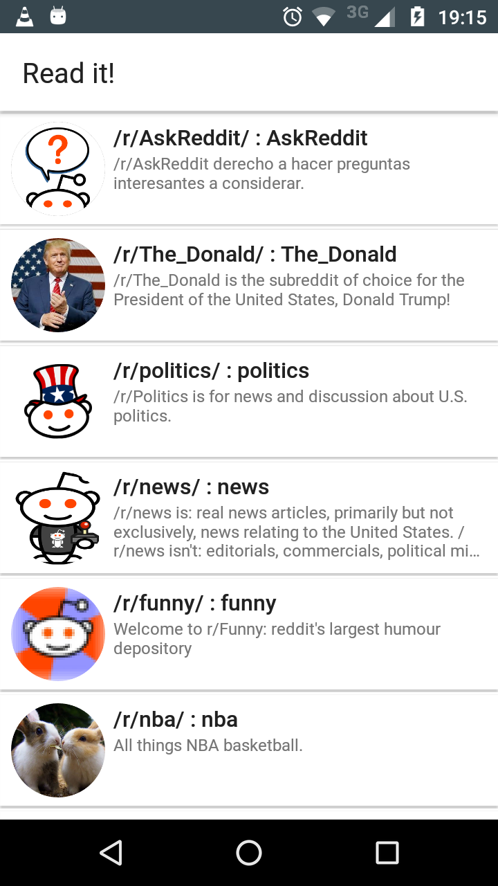
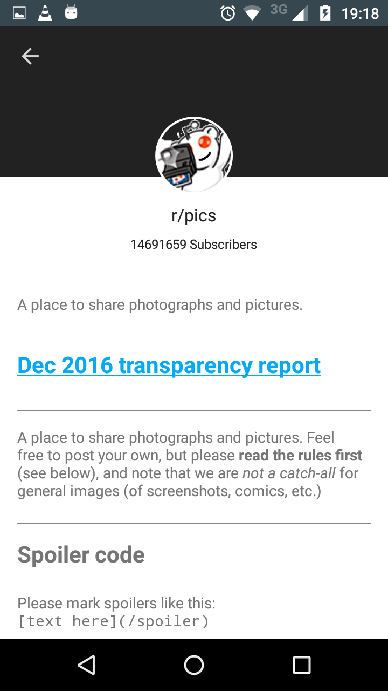

# Read it! - SubReddit explorer 

Android application example using the Reddit API (https://www.reddit.com/reddits.json).

# Available in Play Store

# Mockups

* [Mockups](./Mockups/Reddit.pdf)

# Screenshots

* [Screenshots](./Screenshots)

### Main screen

### Detail screen

